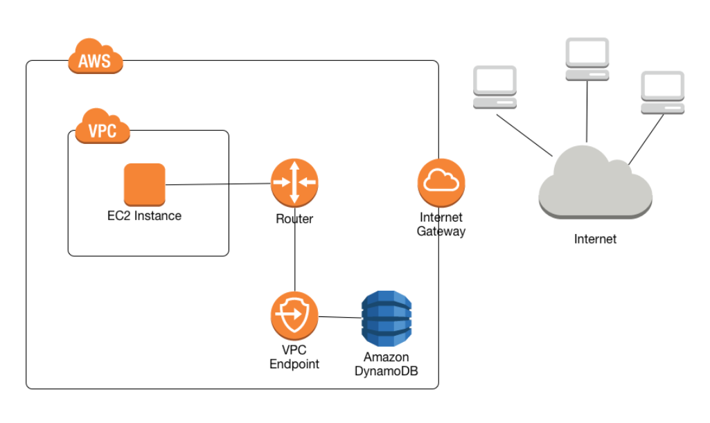

# DynamoDB-EC2 access

In this documentation we will use terraform to implement an ec2 service that has access to a DynamoDB table. This access will be done through the implementation of a VPC endpoint and its scheme is reflected below.





For this use case, I have done all the deployment in my local account, storing the tfstate file in an s3 bucket.
Keep in mind that it is a good practice to have complete monitoring of deployments and have version control, deploy them through a pipeline, which can be with deployment tools such as GitHub actions or azure Devops.

If you consider it appropriate, I could prepare a documentation of how to carry out the deployment through a pipeline.

## List of resources to be deployed.

- VPC with 2 public and private subnets with their respective route tables.
- VPC endpoint to establish connections with both the s3 for the *tfstate* and the secure connection between EC2 and the DynamoDB table.
- Credentials to the EC2 instance. 
- EC2 instance.
- Creation of a basic DynamoDB table, which consists of a scoring system for a game.
- IAM role attached to EC2 instance, with read-only policies.


## Terraform command

Assuming that we already have terraform installed, we will proceed to launch the following commands for the deployment of the infrastructure.

```console
terraform init
```

Then validate the syntax of the code.

```console
terraform validate
```

Launch  a plan to see all the resources to be deployed and from which file (*test.tfvars*) we will load our variables.

```console
terraform plan --var-file=test.tfvars
```

Launch  a apply to deploy all the resources and from which file (*test.tfvars*) we will load our variables.

```console
terraform apply --var-file=test.tfvars
```

All the deployment information will be stored in a *ftstate* that will be stored in an s3 bucket.


## Security considerations

- Private VPC deployed.
- VPC endpoint for the connection between the ec2 instance and the DynamoDB table.
- The connection to the server is made through port 22 and only from authorized IP's, an alternative would be to establish the connection from SSM manager, but it would be necessary to have a connection to the AWS account and the necessary roles of SSM session.
- The connection between EC2 and DynamoDB is made through a VPC endpoint and the EC2 instance having enough roles to connect to the table.
- DynamoDB roles are limited to read only.
- Both the instance disk and the database are encrypted.